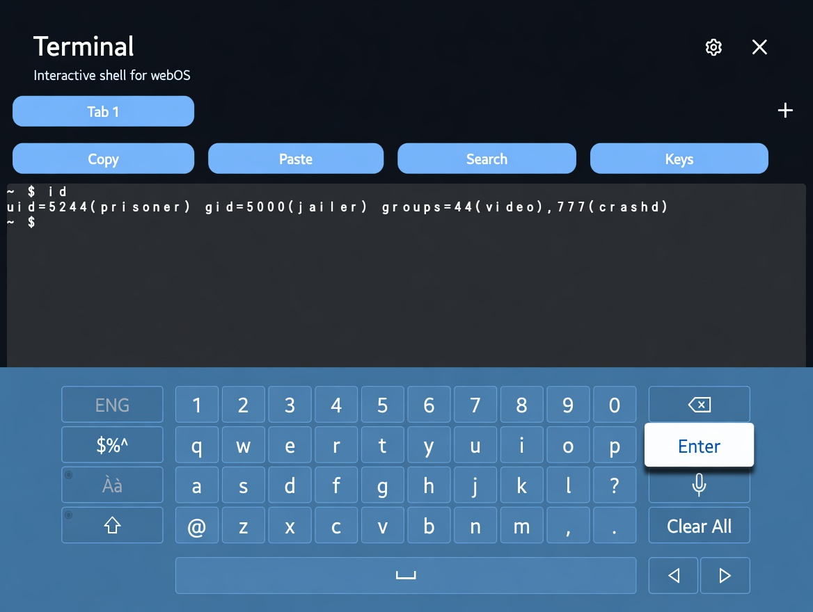

  

# webOS Terminal

A native terminal app for LG webOS TVs. Open a shell right on your TV — no laptop required.

> **Root required.** This app only works on a **rooted** LG webOS TV with **Homebrew Channel** installed. Stock (non-rooted) TVs are not supported — LG blocks the shell access the app needs.

  

## What is this?

webOS Terminal brings a familiar command-line experience to your TV. Launch it from the app launcher, type commands, and interact with the Linux shell underneath webOS — all from the couch, using your remote.

It is built for people who have already rooted their TV and want quick on-device shell access for tinkering, debugging, or running simple commands — without SSH from another machine.

## Why use it?

Most ways to reach a webOS shell today need a second device:

- SSH from a PC
- dev-manager-desktop on a computer
- Old, unmaintained terminal apps

webOS Terminal runs **on the TV itself**. That makes it handy when you do not have a computer nearby, or when you just want a fast way to check something on the device.

It does not replace SSH — it complements it. Use SSH when you need a full desktop workflow; use webOS Terminal when you want shell access on the TV.

## What can you do?

In this early release you can:

- Run common shell commands interactively
- Use the app with your TV remote and on-screen keyboard
- Work on a TV-sized terminal with readable text and scrolling
- Open multiple tabs, each with its own shell session
- With a real PTY (service elevated as root): shell line editing, history, tab completion, job control, and full-screen apps such as `vim`, `htop`, `less`, and `tmux`

Planned for later:

- File browsing
- Log viewing

## Requirements

**You must have a rooted TV.** Without root, the terminal cannot access a real shell and the app will not work.

- **Rooted LG webOS TV** — see [webosbrew.org/rooting](https://www.webosbrew.org/rooting/) or [cani.rootmy.tv](https://cani.rootmy.tv)
- **Homebrew Channel** — installed as part of rooting; needed for SSH during install and for shell services at runtime
- **webOS 4.x or newer** recommended

**Not supported:** stock/non-rooted TVs, Developer Mode–only setups without root, and TVs without Homebrew Channel. Sideloading the app onto an unrooted TV will not give you a working terminal.

## Getting started

See **[README.install.md](README.install.md)** for step-by-step installation and first-launch instructions.

Quick summary (rooted TVs only):

1. **Root your TV** and install Homebrew Channel — this is mandatory, not optional.
2. Sideload webOS Terminal from a computer — see **[README.install.md](README.install.md)**.
3. Launch **webOS Terminal** from your app list.

To run the terminal as **root** (not the default `prisoner` user), see **[Running as root](README.install.md#running-as-root)** in the install guide (includes an optional [auto-elevate on boot](README.install.md#auto-elevate-on-every-boot) hook).

## Status

This is an **early MVP**. It works for basic interactive shell use on rooted devices.

### PTY support

A real terminal session (job control, shell readline, tab completion, `vim`, `htop`, `less`, `tmux`) needs a pseudo-terminal (PTY), which the default jailed `prisoner` user can't allocate (`/dev/ptmx` is blocked). To fix this, the app ships **`ptybridge`** — a small native helper (`native/ptybridge/ptybridge.c`) that allocates and bridges a real PTY itself, independent of whatever shell it inherited from.

When the service reports a working PTY, the client switches to **raw character passthrough**: every keystroke goes straight to the shell, and the shell/TTY owns echo, history, completion, and full-screen apps. Without a PTY (piped fallback), the app keeps its client-side line buffer and up/down history instead.

The service picks the right prebuilt binary for your TV's CPU automatically at runtime (matched against `process.arch`), and it's compiled statically so it has no runtime library dependencies:

| Architecture | Binary | Covers |
|---|---|---|
| ARMv7 (hard-float) | `services/bin/ptybridge-armv7` | Most LG webOS TVs |
| ARM64 | `services/bin/ptybridge-aarch64` | Newer TVs/SoCs |
| x86_64 | `services/bin/ptybridge-x86_64` | webOS OSE emulator, x86-based firmware |

If `ptybridge` isn't available or fails on a given TV's firmware, the app falls back to `script`-based PTY allocation, and finally to a plain piped shell (no PTY, client-side line history only) — so the terminal keeps working either way, just with fewer capabilities in the fallback tiers.

Running the shell service as **root** removes the jail's filesystem restrictions, which `ptybridge` needs to open `/dev/ptmx` — see **[Running as root](README.install.md#running-as-root)** for setup steps.

Feedback and contributions are welcome.

## License

MIT

## Tested on

- OLED55C56LB / webOS 25
- UP7550PTC / webOS 6.5.3